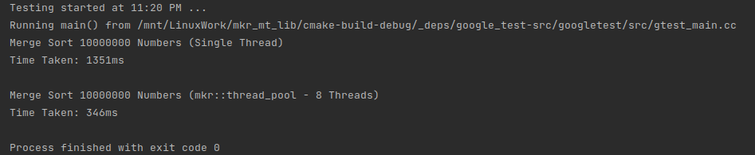

# mkr_multithread_library
## WARNING: THIS WAS MADE FOR MY PERSONAL LEARNING AND IS HIGHLY EXPERIMENTAL. EXPECT BUGS.

### About
Simple C++ multithread library.

Documentation: https://typedefinition.github.io/mkr_mt_lib/

### Features
- Threadsafe Stack
- Threadsafe Queue
- Threadsafe List
- Threadsafe Hashtable
- Job-stealing task pool.

### Single-thread vs Multi-thread Mergesort Results

### Learning Materials
- [CppCon 2017: Ansel Sermersheim “Multithreading is the answer. What is the question?"](https://www.youtube.com/watch?v=sDLQWivf1-I)
- [C++ Concurrency in Action: Practical Multithreading by Anthony Williams](https://www.cplusplusconcurrencyinaction.com/)